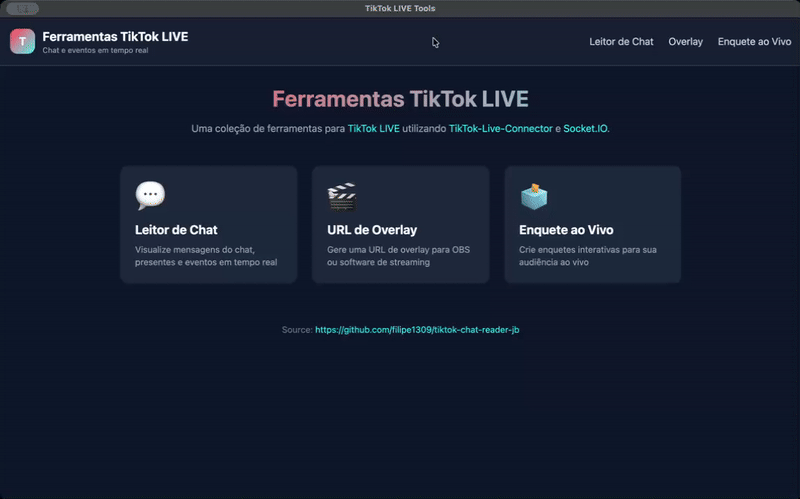

# TikTok LIVE Chat Reader

[](https://opensource.org/licenses/MIT)
[](https://nodejs.org/)
[](https://www.typescriptlang.org/)
[](https://socket.io/)

A chat reader and poll application for TikTok LIVE streams utilizing TikTok-Live-Connector and Socket.IO. Built with TypeScript using Clean Architecture principles. Available as a web server or desktop application (Electron).



## 📑 Table of Contents

- [Features](#-features)
- [Quick Start](#-quick-start)
- [Development](#-development)
- [Configuration](#-configuration)
- [Building Desktop App](#-building-desktop-app-electron)
- [Web Pages](#-web-pages)
- [Poll Feature](#-poll-feature)
- [Troubleshooting](#-troubleshooting)
- [License](#-license)
- [Credits](#-credits)

## ✨ Features

- 💬 **Real-time Chat Reading** - Display TikTok LIVE chat messages instantly
- 🗳️ **Interactive Polls** - Create polls where viewers vote by typing numbers in chat
- 🎬 **OBS Overlay Support** - Dedicated overlay pages for streaming software
- 🖥️ **Cross-platform Desktop App** - Standalone Electron app for Windows and macOS
- 🏗️ **Clean Architecture** - Well-structured TypeScript codebase
- ⚡ **Rate Limiting** - Built-in protection against excessive requests
- 🔌 **Socket.IO Integration** - Real-time bidirectional communication

## 🚀 Quick Start

```bash
make install    # Install all dependencies
make dev        # Start development servers
```

## 🛠️ Make Commands

Run `make help` to see all available commands.

## 💻 Development

### Prerequisites

- Node.js 18+
- npm

### Running in Development Mode

```bash
make install          # Install all dependencies
make dev              # Start both backend and frontend dev servers
```

Or run them separately:

```bash
make backend-dev-watch   # Backend with auto-reload (:8081)
make frontend-dev        # Frontend dev server (:3000)
```

### Testing

```bash
make test             # Run all tests
make test-watch       # Run tests in watch mode
make test-coverage    # Run tests with coverage report
```

### Linting

```bash
make lint             # Run linters on both projects
make backend-lint-fix # Fix backend lint issues
```

## ⚙️ Configuration

Configure the application using environment variables:

| Variable | Default | Description |
|----------|---------|-------------|
| `PORT` | `8081` | Server port |
| `SESSIONID` | - | TikTok session ID (optional, for authenticated features) |
| `ENABLE_RATE_LIMIT` | `false` | Enable rate limiting |
| `MAX_CONNECTIONS` | `10` | Maximum concurrent TikTok connections |
| `MAX_REQUESTS_PER_MINUTE` | `5` | Rate limit threshold per client |
| `NODE_ENV` | `development` | Environment mode (`development` or `production`) |
| `STATIC_FILES_PATH` | `./public-react` | Path to static frontend files |

You can set these in a `.env` file in the backend directory or export them in your shell.

## 📦 Building Desktop App (Electron)

Build standalone desktop applications for Windows and macOS:

```bash
make electron-dist    # Build distributable installers
```

### Build Output

Installers are created in `./release/`:

| Platform | Format |
|----------|--------|
| macOS | `.dmg`, `.zip` |
| Windows | `.exe` (NSIS installer + Portable) |

### Development Mode

```bash
make electron-dev     # Build & launch Electron in dev mode
```

## 🌐 Web Pages

| Page | URL |
|------|-----|
| Main | `http://localhost:8081/` |
| OBS Overlay | `http://localhost:8081/obs.html` |
| Live Poll | `http://localhost:8081/poll.html` |

## 🗳️ Poll Feature

The poll feature allows viewers to vote by typing numbers in chat.


### How It Works

1. Connect to a TikTok live stream using the streamer's @username
2. Configure your poll with 2-10 options
3. Set the timer duration (10-300 seconds)
4. Start the poll
5. Viewers vote by typing numbers (1, 2, 3, etc.) in the chat
6. Results update in real-time

### Features

- **One vote per user** - Each viewer can only vote once per poll
- **Real-time results** - Vote counts and percentages update instantly
- **Vote logging** - Optional detailed log of each vote
- **Timer display** - Countdown shows remaining time

## 📝 License

MIT License

## 🙏 Credits

- [TikTok-Live-Connector](https://github.com/zerodytrash/TikTok-Live-Connector)
- Original project by [zerodytrash](https://github.com/zerodytrash/TikTok-Chat-Reader)
